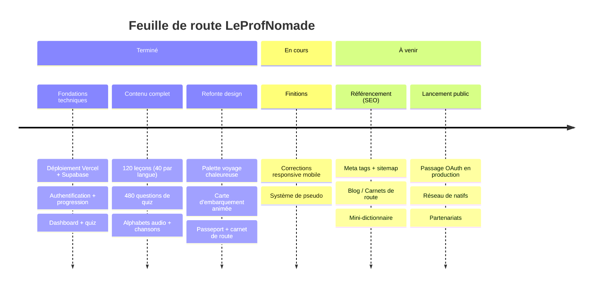

# 🌍 LeProfNomade

**Apprends une langue comme si tu découvrais un pays.**

LeProfNomade est une plateforme d'apprentissage des langues, gratuite et en français, qui enseigne l'anglais, le coréen et l'italien. Au lieu de la répétition gamifiée, elle mise sur de vraies explications, des mises en situation de voyage et les codes culturels que les applications classiques n'enseignent pas.

🔗 **[leprofnomade.vercel.app](https://leprofnomade.vercel.app)**

---

## ✨ La philosophie

La plupart des applications de langues font mémoriser des phrases hors-sol et récompensent l'assiduité plutôt que la compréhension. LeProfNomade prend le contre-pied :

- **Un prof qui explique** — le « pourquoi » derrière chaque règle, pas seulement le « quoi ».
- **De vraies situations** — l'aéroport, le restaurant, le marché, la rue. On apprend ce qui sert vraiment en voyage.
- **La culture incluse** — les codes sociaux et culturels qu'aucune app n'enseigne (les niveaux de politesse coréens, le rituel de l'aperitivo, l'art du small talk britannique).
- **Zéro pression** — pas de séries à entretenir, pas de culpabilisation. On avance à son rythme.

## 🧭 Le concept de voyage

L'apprentissage est structuré comme un voyage :

- Chaque **langue** est une destination.
- Chaque **escale** (chapitre) couvre une étape : découvrir l'alphabet, survivre à l'aéroport, se déplacer, se loger, manger…
- La progression est matérialisée par une **carte d'embarquement** (un avion qui rejoint la capitale), un **passeport** (un tampon par escale terminée) et un **carnet de route** (le vocabulaire et les notes culturelles accumulés).

## 📚 Contenu

- **3 langues** : anglais, coréen, italien.
- **8 escales par langue**, de l'alphabet aux situations avancées.
- **40 leçons par langue** (120 au total), avec dialogues immersifs, audio et explications.
- **Un quiz par escale** pour valider ses acquis.
- **Alphabets interactifs** avec prononciation audio et chanson pour chaque langue.

## 🎨 Design

Une esthétique de carnet de voyage : tons chauds et terreux (terracotta, olive, moutarde, sauge), texture kraft, typographie éditoriale. Chaque langue possède sa propre couleur inspirée de son pays.

## 🛠️ Stack technique

- **Next.js** (App Router, TypeScript)
- **Supabase** (base de données et authentification)
- **Tailwind CSS**
- **MDX** pour le contenu des leçons
- **Vercel** pour le déploiement

## 📌 Statut

Projet en développement actif. Le contenu des trois langues est complet ; le travail se poursuit sur le design, le référencement et les fonctionnalités communautaires.

## 📄 Licence

Projet personnel. Tous droits réservés.

---

## 🗺️ Feuille de route

---

*Fait avec ❤️ pour rendre l'apprentissage des langues accessible à tous, gratuitement.*
