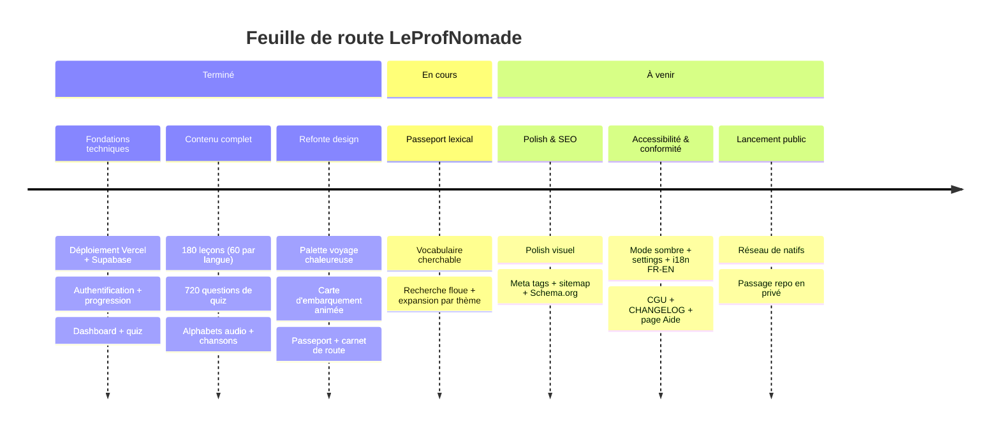

# 🌍 LeProfNomade

**Apprends une langue comme si tu découvrais un pays.**

LeProfNomade est une plateforme d'apprentissage des langues, gratuite et en français, qui enseigne l'anglais, le coréen et l'italien. Au lieu de la répétition gamifiée, elle mise sur de vraies explications, des mises en situation de voyage et les codes culturels que les applications classiques n'enseignent pas.

🔗 **[leprofnomade.vercel.app](https://leprofnomade.vercel.app)**

---

## ✨ La philosophie

La plupart des applications de langues font mémoriser des phrases hors-sol et récompensent l'assiduité plutôt que la compréhension. LeProfNomade prend le contre-pied :

- **Un prof qui explique** — le « pourquoi » derrière chaque règle, pas seulement le « quoi ».
- **De vraies situations** — l'aéroport, le restaurant, le marché, la rue. On apprend ce qui sert vraiment en voyage.
- **La culture incluse** — les codes sociaux et culturels qu'aucune app n'enseigne (les niveaux de politesse coréens, le rituel de l'aperitivo, l'art du small talk britannique).
- **Zéro pression** — pas de séries à entretenir, pas de culpabilisation. On avance à son rythme.

## 🧭 Le concept de voyage

L'apprentissage est structuré comme un voyage :

- Chaque **langue** est une destination.
- Chaque **escale** (chapitre) couvre une étape : découvrir l'alphabet, survivre à l'aéroport, se déplacer, se loger, manger…
- La progression est matérialisée par une **carte d'embarquement** (un avion qui rejoint la capitale), un **passeport** (un tampon par escale terminée) et un **carnet de route** (le vocabulaire et les notes culturelles accumulés).

## 📚 Contenu

- **3 langues** : anglais, coréen, italien.
- **12 escales par langue**, de l'alphabet aux situations avancées.
- **60 leçons par langue** (180 au total), avec dialogues immersifs, audio et explications.
- **36 quiz** (720 questions, 0 doublon) pour valider ses acquis.
- **Alphabets interactifs** avec prononciation audio et chanson pour chaque langue.
- **Passeport lexical** : vocabulaire cherchable par langue (recherche floue, expansion par thème).

## 🎨 Design

Une esthétique de carnet de voyage : tons chauds et terreux (terracotta, olive, moutarde, sauge), texture kraft, typographie éditoriale. Chaque langue possède sa propre couleur inspirée de son pays.

## 🛠️ Stack technique

- **Next.js** (App Router, TypeScript)
- **Supabase** (base de données et authentification)
- **Tailwind CSS**
- **MDX** pour le contenu des leçons
- **Vercel** pour le déploiement

## 📌 Statut

Projet en développement actif. Le contenu des trois langues est complet ; le travail se poursuit sur le Passeport lexical, le polish visuel, le référencement et les fonctionnalités communautaires. Suivi détaillé sur le [board Trello](https://trello.com/b/erRmupaJ/).

## 📜 Charte de développement

Ce projet suit la [Charte de développement unifiée v2.0](docs/CHARTE.md) (desktop & web) : code source privé, pas de raccourcis clavier, accessibilité (mode sombre, police ajustable), vie privée (pas de tracking, CGU claires), interface FR par défaut avec EN ajouté en toute dernière étape avant la v1.0.

## 📄 Licence

Projet personnel. Tous droits réservés.

---

## 🗺️ Feuille de route

Suivi détaillé sur le [board Trello](https://trello.com/b/erRmupaJ/%F0%9F%97%BA%EF%B8%8F-leprofnomade-feuille-de-route).

| Phase | Contenu | Statut |
|-------|---------|--------|
| 1 — Fondations | Stack, auth, leçons MDX, dashboard | ✅ 100% |
| 2 — Design & identité | Palette kraft, carte d'embarquement, passeport, carnet | ✅ 100% |
| 3 — Contenu | 180 leçons + 36 quiz (720 questions, 0 doublon) | ✅ 100% |
| 3.5 — Passeport lexical | Page vocabulaire cherchable par langue | 🔧 85% |
| 3.9 — Polish visuel | Login, footer, méthode, leçons, quiz, LanguageCard | ⏳ 0% |
| 4 — SEO & référencement | Meta tags, sitemap, Open Graph, Schema.org | ⏳ 0% |
| 5 — Social & ouverture | Système d'amis, redirection HelloTalk/Tandem | 💭 Réflexion |
| 6 — Accessibilité & Settings | Mode sombre, police ajustable, page settings, i18n FR+EN | ⏳ 0% |
| 7 — Pré-lancement & conformité | CGU, tests, page erreur, aide, changelog, [charte web](docs/CHARTE.md) | ⏳ 10% |
| ⚙️ Technique | Actions manuelles (repo privé, SQL, clé API…) | ⚠️ Urgent |

```mermaid
timeline
    title Feuille de route LeProfNomade
    section Terminé
        Fondations techniques : Déploiement Vercel + Supabase : Authentification + progression : Dashboard + quiz
        Contenu complet : 180 leçons (60 par langue) : 720 questions de quiz : Alphabets audio + chansons
        Refonte design : Palette voyage chaleureuse : Carte d'embarquement animée : Passeport + carnet de route
    section En cours
        Passeport lexical : Vocabulaire cherchable : Recherche floue + expansion par thème
    section À venir
        Polish & SEO : Polish visuel : Meta tags + sitemap + Schema.org
        Accessibilité & conformité : Mode sombre + settings + i18n FR-EN : CGU + CHANGELOG + page Aide
        Lancement public : Réseau de natifs : Passage repo en privé
```

---

*Fait avec ❤️ pour rendre l'apprentissage des langues accessible à tous, gratuitement.*
